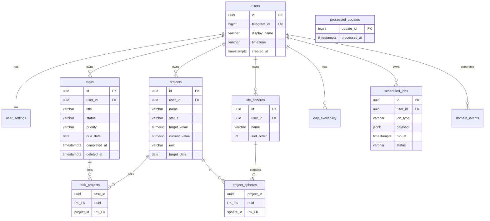

# ER Diagram

**Version:** 0.3  
**See also:** [ARCHITECTURE.md](../architecture/ARCHITECTURE.md)

> Goals удалены (00024): KPI и иерархия — в `projects`.  
> Tasks связаны с projects через `task_projects` (M:N).

---

## Core Schema

---

## Finance

`finance_transactions`, `finance_categories`, `debts` — см. миграции 00008–00009.

---

## Habits

`habits`, `habit_logs` — миграция 00010.

---

## Extended Domains

| Domain | Tables |
|--------|--------|
| Calendar | `calendar_events` |
| Knowledge | `notes`, `note_tags` |
| Health | `health_weight`, `health_steps`, `health_sleep` |
| Career | `career_contacts`, `career_skills` |

---

## Indexes (ключевые)

| Table | Index | Purpose |
|-------|-------|---------|
| tasks | (user_id, due_date) WHERE deleted_at IS NULL | Today view |
| scheduled_jobs | (run_at, status) WHERE status='pending' | Scheduler poll |
| processed_updates | (update_id) | Telegram idempotency |
| life_spheres | (user_id, sort_order) | Sphere list |

## Notes

- Деньги: `amount_cents int64`, currency default `RUB`
- `processed_updates` — idempotency для Telegram
- `scheduled_jobs` — единая очередь reminders + reviews
