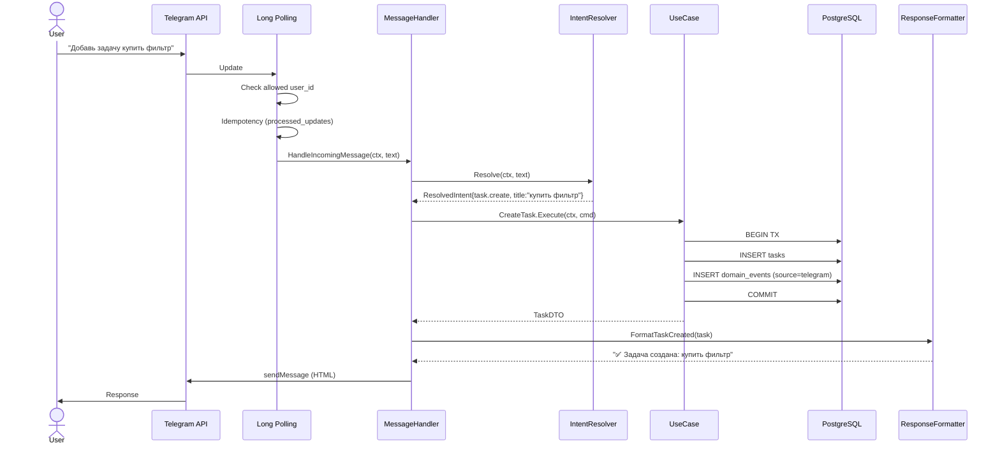
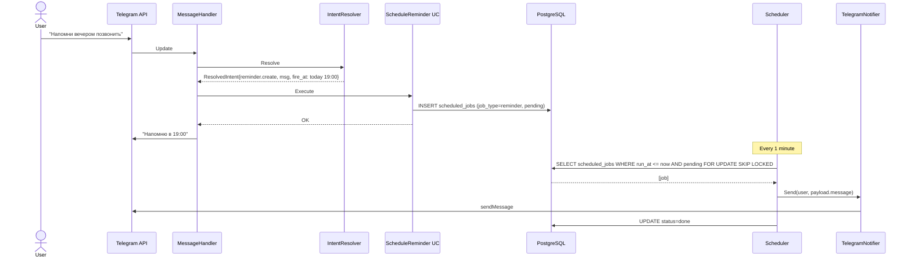
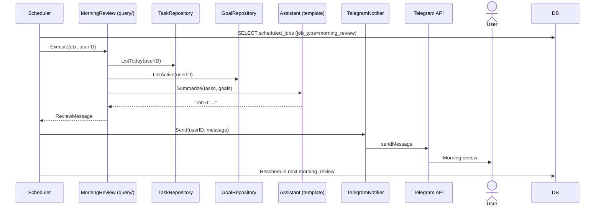
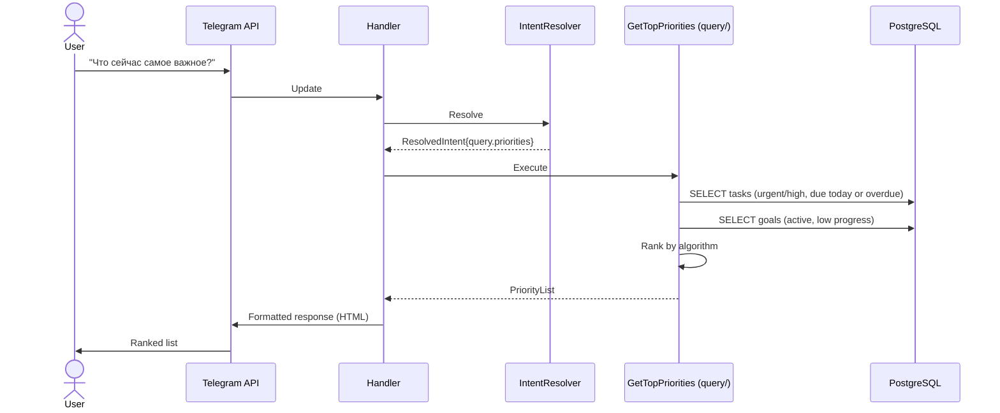
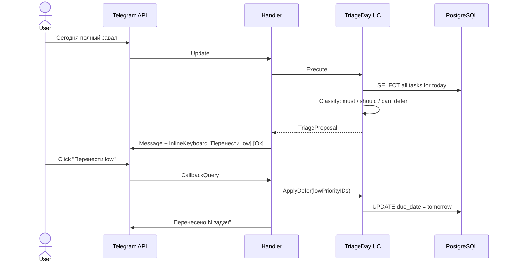
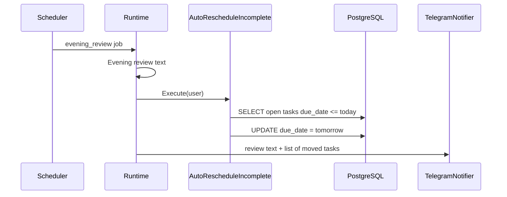
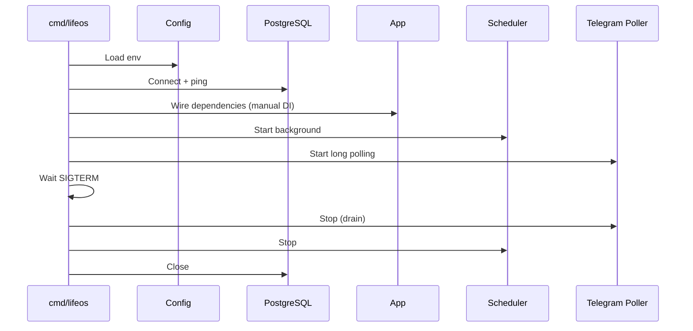
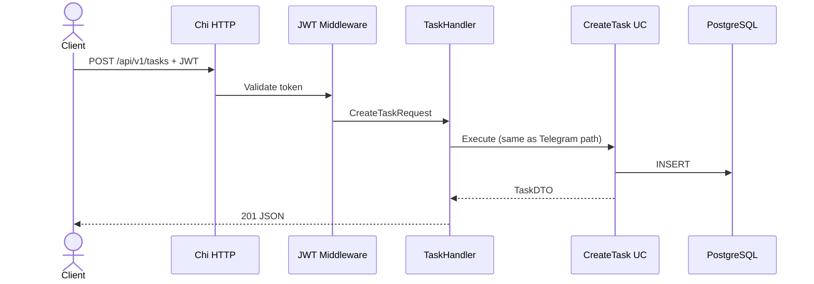

# Sequence Diagrams

**Version:** 0.3  
**See also:** [ARCHITECTURE.md](../architecture/ARCHITECTURE.md)

---

## 1. Incoming Telegram Message

## 2. Reminder Scheduling (unified scheduled_jobs)

## 3. Morning Review (Scheduled)

## 4. Query Priorities

## 5. Overloaded Day Triage

## 5b. Evening auto-reschedule

## 6. Application Bootstrap

## 7. Future REST API (same use cases)

> Phase 3 only. MVP has no REST endpoints.
